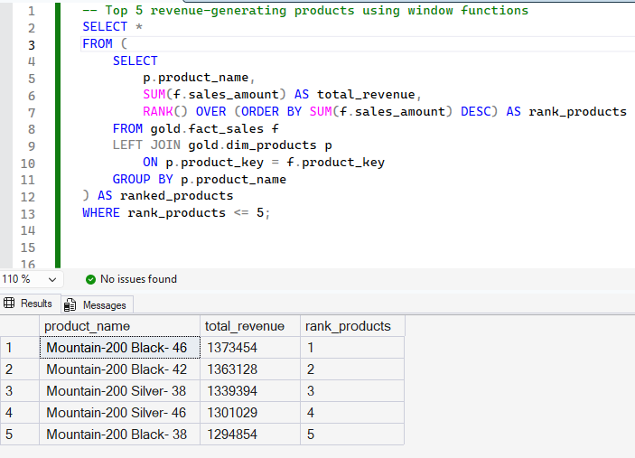
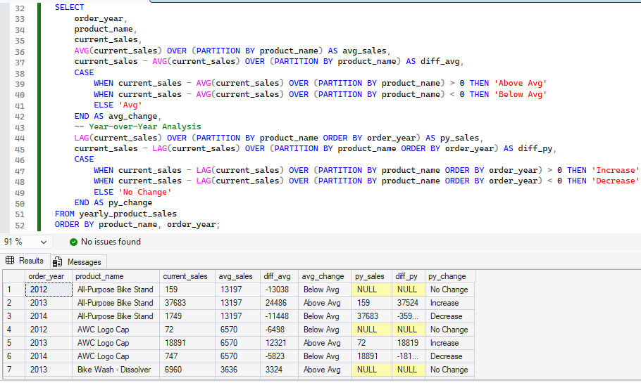
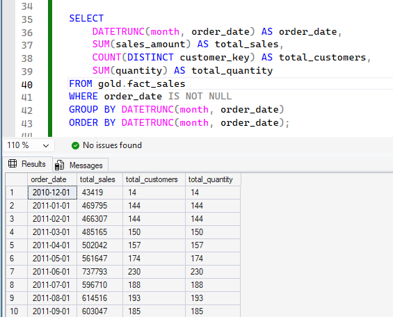
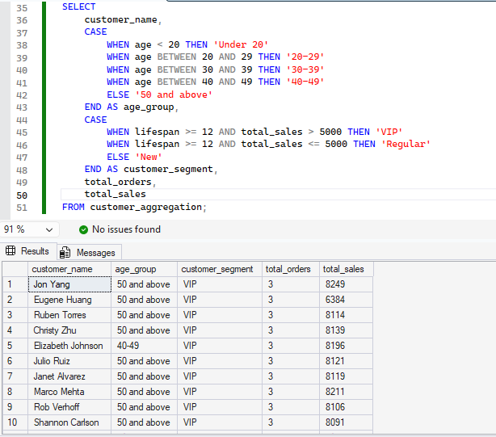

# 📊 End-to-End SQL Data Analytics Project

## 📌 Overview
A comprehensive end-to-end SQL data analytics project focused on data exploration, transformation, and reporting.

This project demonstrates how to analyze structured data using SQL and implement data warehousing concepts (Bronze, Silver, Gold layers).

It includes real-world business analysis such as customer segmentation, sales trends, and performance evaluation.

---
## 📊 Data Analytics Workflow

<p align="center">
  
</p>

<p align="center"><i>End-to-End Data Analytics Process</i></p>

This workflow illustrates the complete data analytics process:

- **Exploratory Data Analysis (EDA)**: Understanding the dataset through database, dimensions, date, and measures exploration.
- **Intermediate Analysis**: Includes magnitude and ranking analysis to identify patterns.
- **Advanced Analytics**: Covers trend analysis, cumulative insights, performance evaluation, and segmentation.
- **Reporting**: Final step where insights are transformed into meaningful business reports.
---
## 📊 Sample Outputs

### 🥇 Top Products by Revenue


### 🥈 Performance Analysis (YoY Comparison)


### 🥉 Sales Trend Over Time


### 🏅 Customer Segmentation


## 📁 Project Structure

### 🔹 Simplified View

- **datasets/** → Raw, cleaned, and transformed data (Bronze, Silver, Gold layers using file naming)
- **scripts/** → SQL queries for exploration, analysis, and reporting  
- **docs/** → Workflow diagram and output screenshots  
- **README.md** → Project documentation  

---


## 📁 Project Structure

```
sql-data-analytics-project/
│
├── datasets/
│   ├── csv-files/                          # bronze layer
│   │   ├── crm_cust_info.csv
│   │   ├── crm_prd_info.csv
│   │   ├── crm_sales_details.csv
│   │   ├── erp_cust_az12.csv
│   │   ├── erp_loc_a101.csv
│   │   └── erp_px_cat_g1v2.csv
│   |
│   |                                       # silver layer
│   │   ├── crm_cust_info.csv
│   │   ├── crm_prd_info.csv
│   │   ├── crm_sales_details.csv
│   │   ├── erp_cust_az12.csv
│   │   ├── erp_loc_a101.csv
│   │   └── erp_px_cat_g1v2.csv
│
│   |                                       # gold layer
│   │   ├── dim_customers.csv
│   │   ├── dim_products.csv
│   │   ├── fact_sales.csv
│   │   ├── report_customers.csv
│   │   └── report_products.csv
│
│   └── DataWarehouseAnalytics.bak
│
├── docs/
│   └── analytics-workflow.png
│
├── scripts/
│   ├── 00_init_database.sql
│   ├── 01_database_exploration.sql
│   ├── 02_dimensions_exploration.sql
│   ├── 03_date_range_exploration.sql
│   ├── 04_measures_exploration.sql
│   ├── 05_magnitude_analysis.sql
│   ├── 06_ranking_analysis.sql
│   ├── 07_change_over_time_analysis.sql
│   ├── 08_cumulative_analysis.sql
│   ├── 09_performance_analysis.sql
│   ├── 10_data_segmentation.sql
│   ├── 11_part_to_whole_analysis.sql
│   ├── 12_report_customers.sql
│   └── 13_report_products.sql
│
└── README.md
```


## ⚙️ Tools & Technologies
- SQL Server
- T-SQL
- Data Warehousing Concepts
- Git & GitHub

---
## 🎯 Business Problem

Businesses often struggle to:
- Identify top-performing products
- Track sales trends over time
- Understand customer behavior and segmentation

This project solves these problems using SQL-based analytics and data warehousing techniques.
---
## 🧠 SQL Concepts Used

- Joins (INNER, LEFT)
- Aggregations (SUM, COUNT)
- Window Functions (RANK, LAG, AVG OVER)
- CTEs (Common Table Expressions)
- Date Functions (DATETRUNC, YEAR, MONTH)

---
## 📊 Key Features
- Data cleaning and transformation
- Customer segmentation (VIP, Regular, New)
- Sales performance analysis
- Aggregations and reporting
- Time-based trend analysis

---

## 📁 Datasets
- Raw CSV files (Bronze layer)
- Processed datasets (Silver/Gold layers)
- SQL Server backup file (.bak)

---


## 🚀 How to Use

1. Restore the database using the `.bak` file in SQL Server
2. Execute SQL scripts from the `scripts/` folder in sequence
3. Run analysis queries to generate insights
---

## 📊 Sample Analysis

- Customer segmentation (VIP, Regular, New)
- Monthly sales trend analysis
- Top-performing products
- Customer purchasing behavior

---
## 🏆 Resume Highlight

Built an end-to-end SQL data analytics pipeline using data warehousing concepts (Bronze, Silver, Gold layers) to analyze sales performance and customer behavior.
