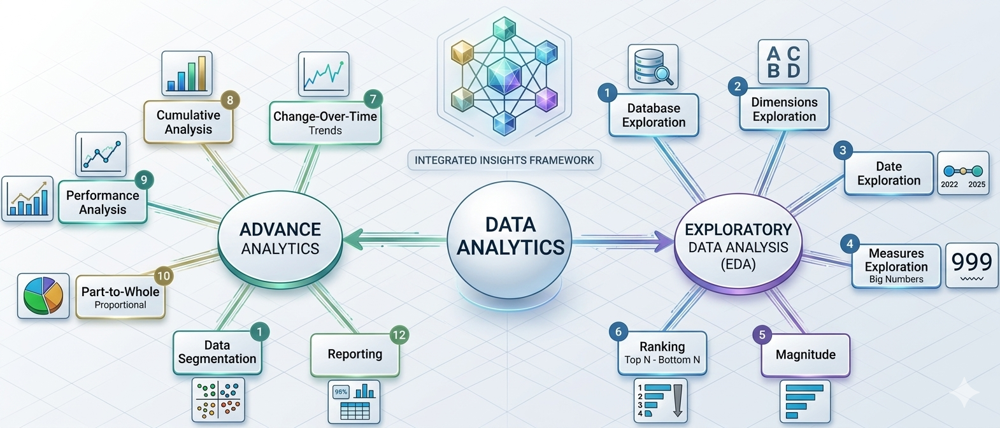

# SQL Data Analytics Project

## 📌 Overview
A comprehensive SQL data analytics project focused on data exploration, transformation, and reporting. This project demonstrates how to analyze structured data using SQL and apply data warehousing concepts.

It includes multiple datasets and SQL scripts to perform real-world business analysis such as customer segmentation, sales trends, and performance metrics.

---
## 📊 Data Analytics Workflow

<p align="center">
  
</p>

<p align="center"><i>End-to-End Data Analytics Process</i></p>

This workflow illustrates the complete data analytics process:

- **Exploratory Data Analysis (EDA)**: Understanding the dataset through database, dimensions, date, and measures exploration.
- **Intermediate Analysis**: Includes magnitude and ranking analysis to identify patterns.
- **Advanced Analytics**: Covers trend analysis, cumulative insights, performance evaluation, and segmentation.
- **Reporting**: Final step where insights are transformed into meaningful business reports.
---

## 📁 Project Structure

```
sql-data-analytics-project/
│
├── datasets/
│   ├── csv-files/                          # bronze layer
│   │   ├── crm_cust_info.csv
│   │   ├── crm_prd_info.csv
│   │   ├── crm_sales_details.csv
│   │   ├── erp_cust_az12.csv
│   │   ├── erp_loc_a101.csv
│   │   └── erp_px_cat_g1v2.csv
│   |
│   |                                       # silver layer
│   │   ├── crm_cust_info.csv
│   │   ├── crm_prd_info.csv
│   │   ├── crm_sales_details.csv
│   │   ├── erp_cust_az12.csv
│   │   ├── erp_loc_a101.csv
│   │   └── erp_px_cat_g1v2.csv
│
│   |                                       # gold layer
│   │   ├── dim_customers.csv
│   │   ├── dim_products.csv
│   │   ├── fact_sales.csv
│   │   ├── report_customers.csv
│   │   └── report_products.csv
│
│   └── DataWarehouseAnalytics.bak
│
├── docs/
│   └── analytics-workflow.png
│
├── scripts/
│   ├── 00_init_database.sql
│   ├── 01_database_exploration.sql
│   ├── 02_dimensions_exploration.sql
│   ├── 03_date_range_exploration.sql
│   ├── 04_measures_exploration.sql
│   ├── 05_magnitude_analysis.sql
│   ├── 06_ranking_analysis.sql
│   ├── 07_change_over_time_analysis.sql
│   ├── 08_cumulative_analysis.sql
│   ├── 09_performance_analysis.sql
│   ├── 10_data_segmentation.sql
│   ├── 11_part_to_whole_analysis.sql
│   ├── 12_report_customers.sql
│   └── 13_report_products.sql
│
└── README.md
```


## ⚙️ Tools & Technologies
- SQL Server
- T-SQL
- Data Warehousing Concepts
- Git & GitHub

---

## 📊 Key Features
- Data cleaning and transformation
- Customer segmentation (VIP, Regular, New)
- Sales performance analysis
- Aggregations and reporting
- Time-based trend analysis

---

## 📁 Datasets
- Raw CSV files (Bronze layer)
- Processed datasets (Silver/Gold layers)
- SQL Server backup file (.bak)

---

## 🚀 How to Use

1. Restore the database using `.bak` file in SQL Server
2. Run SQL scripts from the `scripts` folder
3. Explore queries for analysis and reporting

---

## 📈 Sample Analysis
- Total sales by customer
- Monthly sales trends
- Top-performing products
- Customer purchase behavior

